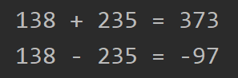

# Java

## Variablen und Datentypen

### Aufgabe 1.2 - Einfache Rechenaufgaben

Deklariere zwei numerische Variablen mit beliebigen Werten. Errechne deren Summe, Differenz, Produkt und Quotient und gib die Rechnung mit dem Ergebnis mit `System.out.println`/`System.out.printf` auf der Konsole aus. 
Rechne einmal mit ganzzahligen und einmal mit gebrochenen Zahlen! 

Bonus: Gib die Kommazahlen schön formatiert auf der Konsole aus. 

Eine Ausgabe sollte folgendermaßen aussehen: 

----------------------------------------------------------------------------

# Java

## Variables and datatypes

### Exercise 1.2 - Simple Calculations

Declare two numeric variables with arbitary values. Calculate their sum, difference, product and quotient and print the calculation with the result on the console with `System.out.println`/`System.out.printf`. 
Perform all calculations with whole numbers and fractional numbers.

Bonus: Try to limit the decimal places of your calculations with the fractional numbers. 

Your output should look like this:

